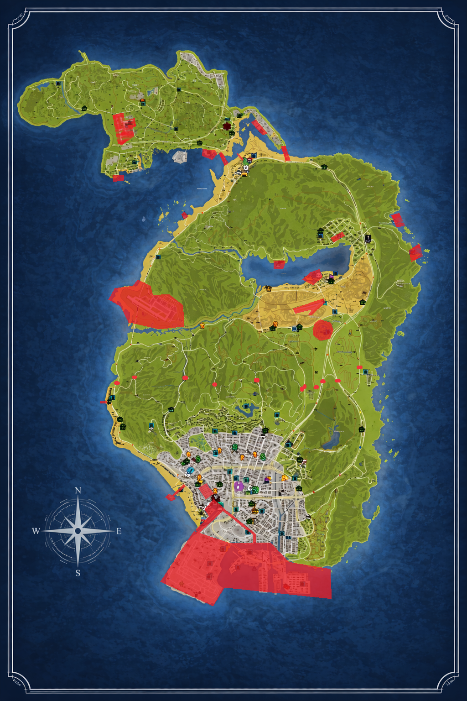

# Douanegebieden

In de volgende, op de kaart gemarkeerde, Douanegebieden mag de Militaire Politie preventief fouilleren en controle uitoefenen op goederen en lucht-, vaar- en voertuigen.

Alle wateren van Springbank vallen onder het Douanegebied. Onder 'wateren' wordt mede begrepen de direct aan het water grenzende gebieden, zoals kustlijnen, stranden, oevers, duinen en zandpaden.

## Kaartweergave

